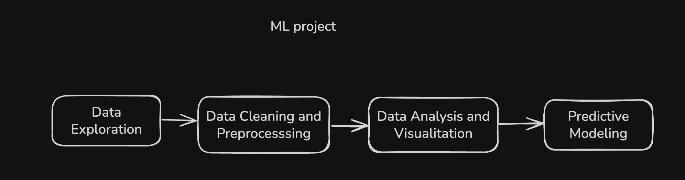
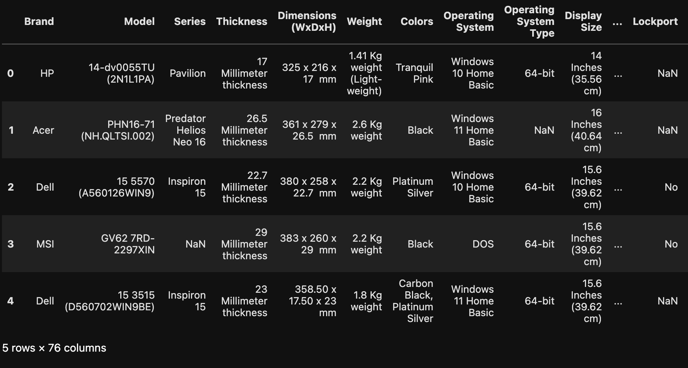
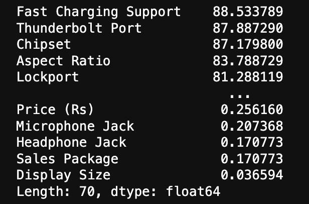
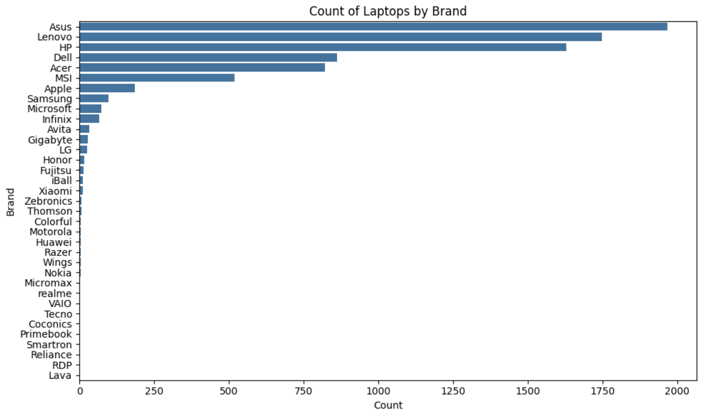
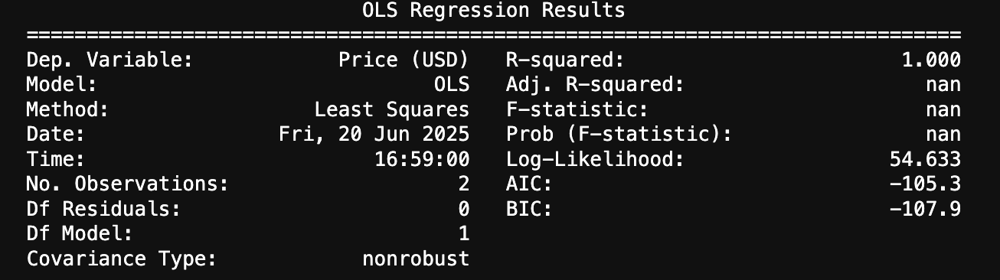
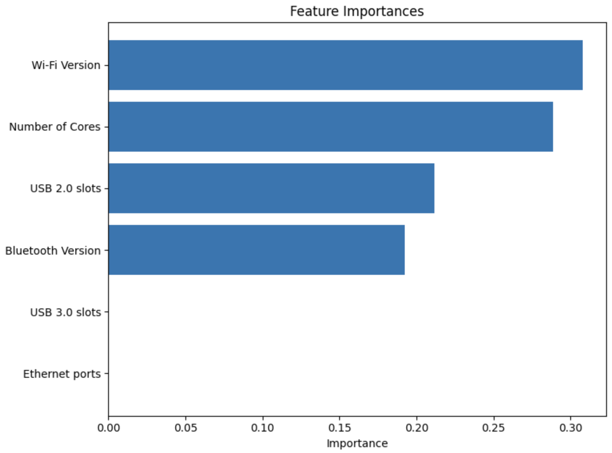

# MLOps DSRP Project

## 1. Problem description
_This project aims to predict the prices of laptops based on their technical specifications, such as processor type, RAM size, storage capacity, brand, and other key features. Using a regression model, the project analyzes the relationship between these specifications and the corresponding laptop prices to provide accurate price predictions._

 - Problem type: Linear Regression

### Dataset
Dataset obtains by [kaggle]("https://www.kaggle.com/datasets").

<a target="_blank" href="https://cookiecutter-data-science.drivendata.org/">
    
</a>

## 2. Project Workflow


## 3. Data exploration
_The dataset has 76 columns on the specifications, the fields are of text, numeric and null type._



## 4. Data Cleaning and Preprocessing

_Given the amount of data, we proceed to clean and take only the numerical and necessary fields that will be used for the prediction. The values will be converted to the correct data type._



## 5. Data Analysis and Visualizations

_Having cleaned the data, we now move to visualizations to uncover relationships among features. We apply a series of visualizations such as histograms for distribution analysis, count plots for categorical frequencies, box plots for outlier detection, and a correlation heatmap if applicable. This multipronged strategy gives us a better insight into the structure of the dataset._



## 6. Predictive Modeling
_Now that we have cleaned and analyzed our data, let's attempt to predict the price of a laptop based on a few key numeric features. We are using the features we cleaned earlier and a RandomForestRegressor for this regression task._

_The notebook computes the performance metrics (R2 score and Root Mean Squared Error) to assess the prediction accuracy. We also visualize the permutation importance of the features to see which ones contribute the most to the prediction._






## 7. Project Organization

```
├── LICENSE            <- Open-source license if one is chosen
├── Makefile           <- Makefile with convenience commands like `make data` or `make train`
├── README.md          <- The top-level README for developers using this project.
├── data
│   ├── external       <- Data from third party sources.
│   ├── interim        <- Intermediate data that has been transformed.
│   ├── processed      <- The final, canonical data sets for modeling.
│   └── raw            <- The original, immutable data dump.
│
├── docs               <- A default mkdocs project; see www.mkdocs.org for details
│
├── models             <- Trained and serialized models, model predictions, or model summaries
│
├── notebooks          <- Jupyter notebooks. Naming convention is a number (for ordering),
│                         the creator's initials, and a short `-` delimited description, e.g.
│                         `1.0-jqp-initial-data-exploration`.
│
├── pyproject.toml     <- Project configuration file with package metadata for 
│                         package_dsrp_mle and configuration for tools like black
│
├── references         <- Data dictionaries, manuals, and all other explanatory materials.
│
├── reports            <- Generated analysis as HTML, PDF, LaTeX, etc.
│   └── figures        <- Generated graphics and figures to be used in reporting
│
├── requirements.txt   <- The requirements file for reproducing the analysis environment, e.g.
│                         generated with `pip freeze > requirements.txt`
│
├── setup.cfg          <- Configuration file for flake8
│
└── package_dsrp_mle   <- Source code for use in this project.
    │
    ├── __init__.py             <- Makes package_dsrp_mle a Python module
    │
    ├── config.py               <- Store useful variables and configuration
    │
    ├── dataset.py              <- Scripts to download or generate data
    │
    ├── features.py             <- Code to create features for modeling
    │
    ├── modeling                
    │   ├── __init__.py 
    │   ├── predict.py          <- Code to run model inference with trained models          
    │   └── train.py            <- Code to train models
    │
    └── plots.py                <- Code to create visualizations
```

--------

## 8. References
- https://developers.google.com/machine-learning/crash-course

- https://medium.com/@RobuRishabh/introduction-to-machine-learning-555b0f1b62f5